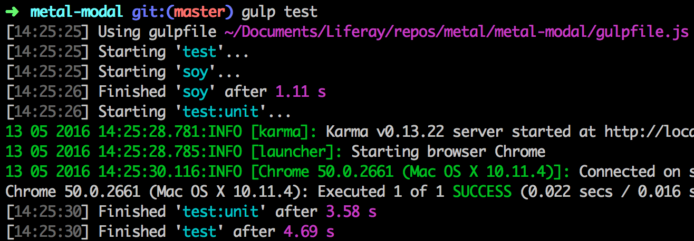

###### {$page.description}

<article id="1">

## Tutorial: Modal - Testing

In the [previous section](/docs/modal_nested.html) we've completed our **Modal** component. The last thing we'd like to show is how to use the tools that **Metal.js** offers to help you test your code.

## Test script

If you look at your **package.json** file you'll notice that it already contains a test script that you can use:

```javascript
{
	"scripts": {
		"test": "gulp test"
	}
}
```

If you're building a project without the generator, you can still get **Metal.js**'s test tools by using [gulp-metal](/docs/gulp_metal.html).

## Adding a test

Also note that your generated project directory also has a file called **test/Modal.js**, with a failing assertion. As you can imagine, all you need to do is add your tests to this file.

To illustrate this let's start by replacing the existing test with one that checks that the given `body` data is being rendered correctly:

```javascript
import Modal from '../src/Modal';

describe('Modal', function() {
	it('should render the body', function() {
		var component = new Modal({
			body: 'Test Body'
		});
		var bodyElement = component.element.querySelector('.modal-body');
		assert.ok(bodyElement);
		assert.strictEqual('Test Body', bodyElement.textContent);
	});
});
```
## Running the tests

To run our tests all you need to do is type `npm test` on your terminal. You'll see something like this:



## Test environment

This test file we wrote uses [Mocha](http://mochajs.org) and [Chai](http://chaijs.com/) for describing tests, and [Karma](http://karma-runner.github.io/0.12/index.html) as the test runner. That's the default setup used by **gulp-metal**.

It's important to note that you don't have to use **gulp-metal** for you tests though. It's just an easy way that's already provided for you, but you can certainly setup your own environment if you wish.

## Next steps

You should now have a good knowledge of **Metal.js** basics. If you want to dive into more details and advanced topics, go ahead and check some of our guides.

</article>
